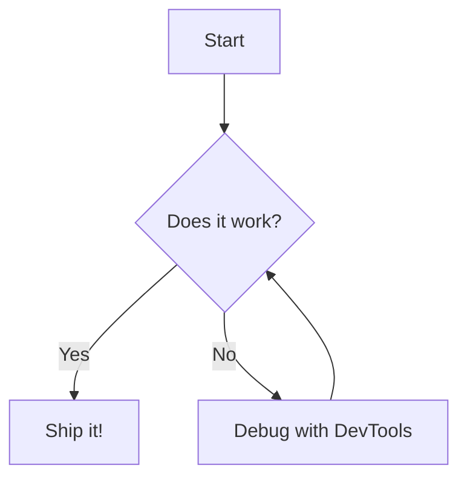

# Mermaid Diagrams

The Mermaid plugin brings declarative diagramming to Resin. You describe flowcharts, architecture maps, sequence flows, or timelines in text, and Resin renders them as sharp, theme-adaptive vector graphics in Live Preview.

---

## How to Create a Diagram

In your editor, open a fenced code block with the `mermaid` language identifier:

````markdown

````

As soon as your cursor moves out of the block, CodeMirror renders the interactive diagram widget. Moving your cursor back into the block reveals the source text for editing.

---

## Diagram Actions

Hovering over any rendered Mermaid diagram reveals a floating action bar:

- **Copy SVG**: Copy the rendered high-resolution vector SVG directly to your clipboard for pasting into slides, documents, or Figma.
- **Copy Source**: Copy the underlying raw text to your clipboard.
- **View Source**: Quick toggle to view the code without moving your cursor.
- **Lightbox**: Open the diagram in a full-screen zoom and pan canvas.

---

## Theme Adaptability

Mermaid diagrams in Resin automatically inherit your active theme colors:

- Backgrounds adjust to `--background-secondary`.
- Text matches `--text-normal` and `--font-ui`.
- Edges and connections respect `--accent-color`.

When you switch between Dark and Light mode, diagrams re-render dynamically to match.


