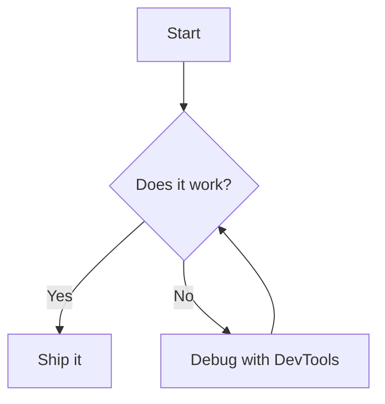

# Mermaid Diagrams

Describe flowcharts, architecture diagrams, sequence maps, or state machines in text, and Resin renders them as theme-adaptive vector diagrams in Live Preview.

![[mermaid-rendered-flowchart.png|Rendered Mermaid flowchart in Live Preview]]

## Create a Diagram

Open a fenced code block with the `mermaid` language identifier:

````markdown

```mermaid
graph TD
    A[Start] --> B{Does it work?}
    B -- Yes --> C[Ship it]
    B -- No --> D[Debug with DevTools]
    D --> B
```
````

When your cursor moves out of the block, Resin renders the interactive diagram widget. Moving your cursor back into the block reveals the source text.

## Diagram Interactions

Hovering over a rendered diagram displays a floating toolbar with an **Edit** button. Clicking **Edit** or clicking directly into the block switches the widget into Markdown source mode so you can modify the diagram syntax.

## Theme Integration

Diagrams inherit your active Resin theme colors:
- Nodes match `--background-secondary` and `--text-normal`
- Lines and connectors use `--accent-color`
- Font inherits `--font-ui`
- Diagrams re-render instantly when switching between Light and Dark themes


