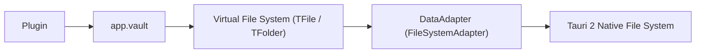

# Vault & Virtual File System (VFS)

The `Vault` subsystem (`app.vault`) manages all files and directories in the user's workspace. It combines an ultra-fast **in-memory Virtual File System** with non-blocking asynchronous disk persistence.

---

## 1. Virtual File System Tree: `TFile` & `TFolder`

Files and folders are represented as structured node objects:

### `TAbstractFile` (Base)

- `path`: Normalized relative path from vault root (e.g. `Projects/Roadmap.md`).
- `name`: File or folder name with extension (e.g. `Roadmap.md`).
- `parent`: Reference to parent `TFolder` (or `null` for vault root).
- `vault`: Reference to host `Vault` instance.

### `TFile` (File Node)

- `basename`: File name without extension (e.g. `Roadmap`).
- `extension`: File extension (e.g. `md`, `png`, `pdf`).
- `stat`: File metadata (`ctime`, `mtime`, `size`).

### `TFolder` (Folder Node)

- `children`: Array of child `TAbstractFile` instances (`TFile` | `TFolder`).
- `isRoot()`: Returns `true` if this is the vault root directory.

---

## 2. Reading and Writing Notes

```ts
// 1. Read note content from disk
const content = await this.app.vault.read("Notes/Idea.md");

// 2. Write note content optimistically (emits 'file:modified' in 0ms)
await this.app.vault.write(
  "Notes/Idea.md",
  "# Updated Title\n\nNew body content.",
);

// 3. Create a brand new note
const newFile = await this.app.vault.create(
  "Notes/New Idea.md",
  "# New Idea\n\nContent here.",
);
console.log("Created note with path:", newFile.path);

// 4. Create a directory folder
const newFolder = await this.app.vault.createFolder("Projects/2026");
```

---

## 3. Renaming, Duplicating, and Trashing

```ts
// Rename or move a note (automatically updates referencing wikilinks across the vault!)
await this.app.vault.rename("Notes/OldName.md", "Archive/NewName.md");

// Duplicate a file with automatic sequence collision-free naming (e.g. "Idea 1.md")
const copy = await this.app.vault.duplicate("Notes/Idea.md");

// Send file to native OS Recycle Bin
await this.app.vault.trash("Notes/Temporary.md");
```

> [!NOTE]
> **Automatic Backlink Refactoring**:
> When you rename a markdown note with `app.vault.rename()`, Resin queries the `MetadataCache` link graph, finds all referencing notes containing `[[OldName]]`, `[[OldName#heading]]`, or `[[OldName|alias]]`, and updates their contents automatically. Any open editor leaves viewing referencing files reload seamlessly without resetting cursor position.

---

## 4. Low-Level Storage: `DataAdapter`

Resin decouples high-level vault operations from raw file system I/O using a **`DataAdapter`** abstraction layer, mirroring Obsidian's internal architecture:



The adapter is directly accessible via `app.vault.adapter`:

```ts
const adapter = this.app.vault.adapter;

// Low-level disk operations
const exists = await adapter.exists("config.json");
const text = await adapter.read("config.json");
await adapter.write("config.json", JSON.stringify({ theme: "dark" }));
await adapter.append("log.txt", "New entry\n");

// Query file statistics
const stat = await adapter.stat("config.json");
console.log(stat?.size, stat?.mtime);

// Directory listing
const entries = await adapter.list("Templates");
```

> [!TIP]
> Use `app.vault.read()` and `app.vault.write()` for normal notes to ensure the VFS in-memory cache and metadata index remain in sync. Use `app.vault.adapter` when performing low-level raw I/O or managing non-note files (like binary assets, plugin configs, or external templates).

---

## 5. Resolving Obsidian-Style Wikilinks

Resin includes a built-in resolver for internal markdown links (`[[Target]]`, `[[Target#Heading]]`, `[[Target|Alias]]`, `[[#Heading]]`):

```ts
const resolution = this.app.vault.resolveWikilink(
  "Project Roadmap#Milestone 1|Q1 Goals",
  "Notes/Meeting.md",
);

console.log(resolution.path); // 'Projects/Project Roadmap.md'
console.log(resolution.exists); // true
console.log(resolution.file); // TFile node
console.log(resolution.heading); // 'Milestone 1'
console.log(resolution.displayText); // 'Q1 Goals'
```

---

## 6. Next Steps

- Explore how metadata is indexed in **[[Metadata cache|MetadataCache & Link Graph]]**.
- Learn about editor autocompletion in **[[Editor suggestions|Editor Suggestions & Autocomplete]]**.
- Learn about the workspace layout tree in **[[Workspace and leaves|Workspace & Layout Tree]]**.
