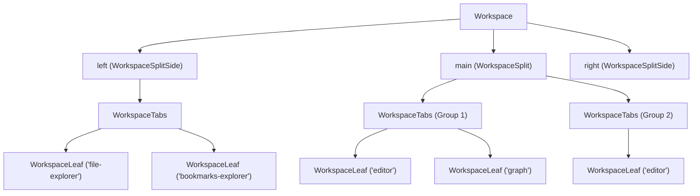

# Workspace & Layout Tree

The `Workspace` subsystem (`app.workspace`) manages the hierarchical layout tree, multi-pane splits, sidebars, tab groups, and leaf views.

---

## 1. The Layout Tree Hierarchy



- **`WorkspaceSplit`**: Holds recursive horizontal or vertical sub-splits and tab groups.
- **`WorkspaceSplitSide`**: Collapsible left/right sidebar containers with `expanded()`, `collapse()`, and `isCollapsed()`.
- **`WorkspaceTabs`**: Represents a tab bar holding an array of `WorkspaceLeaf` instances.
- **`WorkspaceLeaf`**: The individual tab slot that hosts an active `View` instance.

---

## 2. Opening and Revealing Views

### `workspace.openFile(path, options)`

Opens a markdown note in the editor with smart tab reuse:

```ts
// Open in active editor or new tab
await this.app.workspace.openFile("Notes/Daily.md");

// Force open in a brand new tab
await this.app.workspace.openFile("Notes/Daily.md", { newTab: true });

// Open into a specific sidebar split
await this.app.workspace.openFile("Notes/Daily.md", { split: "right" });
```

### `workspace.revealView(type, defaultSplit)`

Finds or creates a leaf for a given view type. If the view is inside a collapsed sidebar, **it automatically expands the sidebar** and activates the tab:

```ts
// Reveals File Explorer, expanding left sidebar if closed
this.app.workspace.revealView("file-explorer", "left");

// Reveals Graph View in the central workspace
this.app.workspace.revealView("graph", "main");
```

### `workspace.revealLeaf(leaf)`

Reveals an existing leaf instance, expanding its parent sidebar if collapsed.

---

## 3. Querying Leaves and Active Tabs

```ts
// 1. Get currently active leaf
const activeLeaf = this.app.workspace.getActiveLeaf();

// 2. Find all open editor leaves
const editorLeaves = this.app.workspace.getLeavesOfType("editor");

// 3. Find all open custom plugin leaves
const graphLeaves = this.app.workspace.getLeavesOfType("graph");

// 4. Iterate over every leaf across all splits and sidebars
this.app.workspace.iterateLeaves((leaf) => {
  console.log(`Leaf ID: ${leaf.id}, View Type: ${leaf.getType()}`);
});
```

---

## 4. Next Steps

- Learn about event listening in **[[Events and lifecycle|Event Bus & Subscriptions]]**.
- Build your own views in **[[Custom views|Custom Workspace Views]]**.
