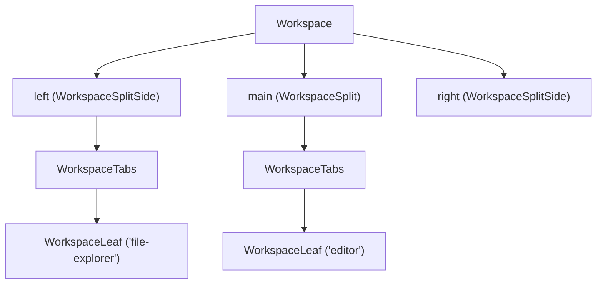

# Workspace and Leaves

The Workspace API (`this.app.workspace`) manages multi-pane splits, sidebars, tabs, and leaf view mounting.

![[workspace-splits-layout-tree.png|Multi-pane workspace layout with sidebars and splits]]

## Layout Tree Structure


```mermaid
graph TD
    Workspace["Workspace"] --> Left["left (WorkspaceSplitSide)"]
    Workspace --> Main["main (WorkspaceSplit)"]
    Workspace --> Right["right (WorkspaceSplitSide)"]

    Left --> LeftTabs["WorkspaceTabs"]
    LeftTabs --> ExplorerLeaf["WorkspaceLeaf ('file-explorer')"]

    Main --> MainTabs["WorkspaceTabs"]
    MainTabs --> EditorLeaf["WorkspaceLeaf ('editor')"]
```

- **`WorkspaceSplitSide`**: Collapsible left/right sidebar containers with `collapse()`, `expand()`, and `toggle()`.
- **`WorkspaceSplit`**: Recursive horizontal or vertical container holding tab groups.
- **`WorkspaceTabs`**: Tab bar managing a collection of `WorkspaceLeaf` slots.
- **`WorkspaceLeaf`**: The individual tab hosting an active `View` instance.

## Open and Reveal Files

```ts
// Open a file in the active editor or reuse an open tab
await this.app.workspace.openFile("Notes/Daily.md");

// Open into a specific split or sidebar
await this.app.workspace.openFile("Notes/Daily.md", { split: "right" });
```

## Reveal Views

`revealView(type, defaultSplit)` activates the leaf matching that view type. If the view is inside a collapsed sidebar, it automatically expands the sidebar:

```ts
// Reveal File Explorer, expanding left sidebar if collapsed
this.app.workspace.revealView("file-explorer", "left");
```

## Query Leaves

```ts
// Active leaf
const activeLeaf = this.app.workspace.activeLeaf;

// All leaves matching a view type
const editorLeaves = this.app.workspace.getLeavesOfType("editor");

// Iterate through every leaf across splits
this.app.workspace.iterateLeaves((leaf) => {
  console.log(`Leaf ${leaf.id}: ${leaf.view.getViewType()}`);
});
```

